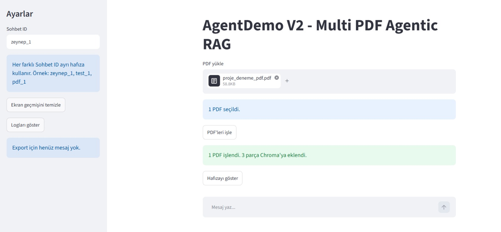
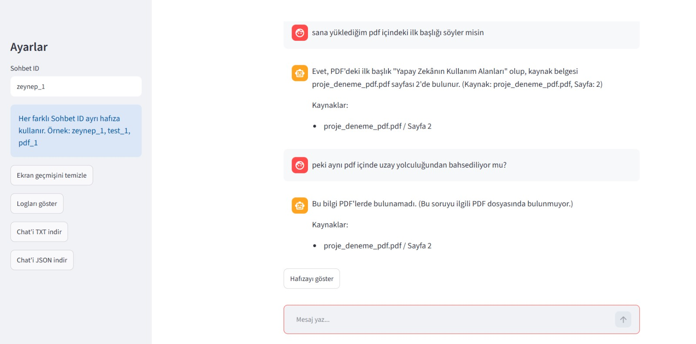
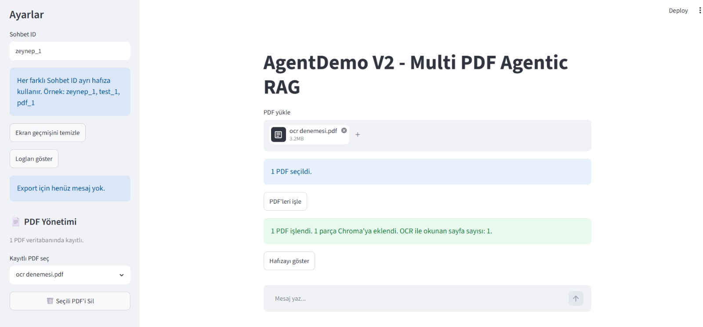
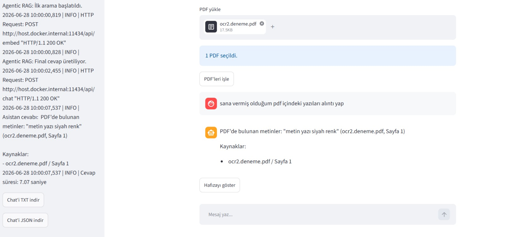
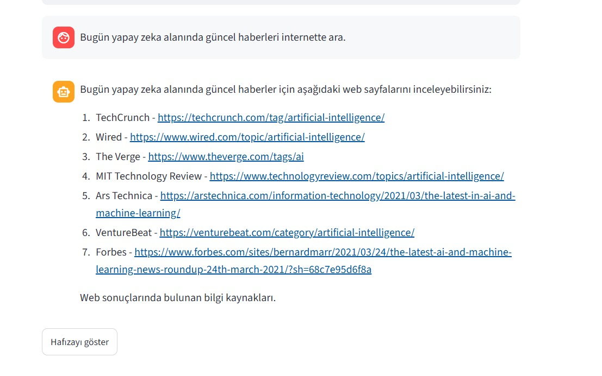

# AgentDemo V3.0 - Local LLM Multi PDF Agentic RAG

AgentDemo V3.0, local LLM kullanarak çalışan, çoklu PDF okuyabilen, OCR destekli, gerçek zamanlı streaming response verebilen ve Agentic RAG mimarisiyle belge sorgulama yapabilen yapay zeka agent uygulamasıdır.

Projede Ollama üzerinden local model çalıştırılır, Streamlit ile kullanıcı arayüzü sağlanır, LangGraph ile SQLite tabanlı kalıcı konuşma hafızası kullanılır ve ChromaDB ile PDF belgeleri üzerinde RAG sistemi uygulanır.

Uygulama; metin tabanlı PDF dosyalarını okuyabilir, taranmış/görsel PDF dosyalarındaki yazıları OCR ile çıkarabilir, aynı PDF dosyasının tekrar eklenmesini engelleyebilir ve eklenen PDF dosyalarını sidebar üzerinden listeleyip silebilir.

Ayrıca gerçek web search entegrasyonu, Docker desteği, GitHub Actions ile otomatik Docker image build süreci ve canlı akan streaming response sistemi projeye eklenmiştir.

---

## Durum

Bu proje, yapay zeka agent mimarisini öğrenmek ve gerçek bir local AI uygulaması geliştirmek amacıyla oluşturulmuştur.

Uygulama Ne Yapabilir?

AgentDemo V3.0 ile kullanıcılar PDF dosyaları yükleyebilir, belgeler hakkında soru sorabilir, taranmış PDF dosyalarındaki yazıları OCR ile okuyabilir ve cevapları gerçek zamanlı streaming olarak alabilir.

Sistem aynı PDF dosyasının tekrar eklenmesini engeller. Eklenen PDF dosyaları sidebar üzerinden listelenebilir, tek tek silinebilir veya tüm PDF veritabanı temizlenebilir.

PDF dışındaki sorularda agent normal local LLM cevabı üretebilir. Güncel bilgi gerektiren sorular için gerçek web search entegrasyonu kullanılabilir.

Proje Docker ile çalıştırılabilir ve GitHub Actions üzerinden otomatik Docker image build süreci desteklenir.

---

## Demo Görseli









## Version 2.0 Özeti

Version 2.0 ile tamamlanan ana özellikler:

* Modüler Python proje yapısı
* Çoklu PDF yükleme desteği
* ChromaDB tabanlı kalıcı vector database
* Ollama Embedding desteği
* Agentic RAG akışı
* Router tabanlı yönlendirme
* SQLite tabanlı kalıcı konuşma hafızası
* Thread ID ile bağımsız sohbet hafızaları
* Kaynak sayfa gösterimli PDF cevapları
* Chat export sistemi
* Log görüntüleme paneli
* Hata yönetimi
* Cevap süresi takibi

---

## Kullanılan Teknolojiler

* Python
* Streamlit
* LangChain
* LangGraph
* Ollama
* ChromaDB
* SQLite
* PyPDFLoader
* RecursiveCharacterTextSplitter
* OllamaEmbeddings
* Python Logging
* Mistral
* nomic-embed-text

---

## Proje Mimarisi

```text
Kullanıcı Mesajı
        │
        ▼
Streamlit Arayüzü
        │
        ▼
Router
        │
 ┌──────┼──────────────┐
 │      │              │
 ▼      ▼              ▼
Tool   Agentic RAG    Agent
 │        │             │
 ▼        ▼             ▼
Demo   ChromaDB     LangGraph
Tool      │             │
          ▼             ▼
       PDF Context   SQLite Memory
          │
          ▼
       Ollama LLM
          │
          ▼
        Cevap
```

---

## Klasör Yapısı

```text
agent-firstproject/
│
├── app.py
├── agent_core.py
├── agentic_rag.py
├── rag.py
├── router.py
├── tools.py
├── logger_config.py
├── requirements.txt
├── README.md
│
├── memory.sqlite
├── memory.sqlite-shm
├── memory.sqlite-wal
├── agent.log
│
├── uploads/
├── chroma_db/
└── screenshots/
    └── rag-demo.jpg
    └── yz1.jpg
    └── yz2.jpg
```

---

## Dosyaların Görevleri

### `app.py`

Streamlit arayüzünü çalıştırır.

Görevleri:

* Chat ekranını oluşturur
* PDF yükleme alanını gösterir
* Sidebar ayarlarını yönetir
* Thread ID seçimini sağlar
* Mesaj geçmişini ekranda tutar
* Router'a kullanıcı mesajını gönderir
* Logları gösterir
* Chat export işlemlerini yönetir

---

### `agent_core.py`

LLM ve LangGraph agent yapısını oluşturur.

Görevleri:

* Ollama üzerinden local LLM başlatır
* Mistral modelini kullanır
* SQLite checkpointer oluşturur
* Kalıcı agent hafızasını yönetir
* Thread ID bazlı konuşma geçmişi sağlar

---

### `rag.py`

PDF dosyalarının okunması ve ChromaDB’ye aktarılmasından sorumludur.

Görevleri:

* PDF dosyalarını okur
* PDF sayfalarını metne çevirir
* Metni chunklara böler
* OllamaEmbeddings ile embedding üretir
* ChromaDB’ye kayıt yapar
* Var olan vectorstore’u tekrar yükler

---

### `agentic_rag.py`

Agentic RAG akışını yönetir.

Görevleri:

* Kullanıcı sorusunun belge araması gerektirip gerektirmediğini belirler
* ChromaDB içinde ilgili PDF parçalarını arar
* Gerekirse sorguyu yeniden yazar
* İlgili PDF parçalarını LLM’e context olarak verir
* Kaynaklı cevap üretir
* PDF içinde bilgi yoksa uydurmak yerine “bulunamadı” cevabı verir

---

### `router.py`

Kullanıcı mesajını doğru sisteme yönlendirir.

Yönlendirme örnekleri:

```text
pdf / belge / doküman / yüklediğim → Agentic RAG

hava → Hava durumu demo tool

eksi / çıkar → Basit matematik demo tool

diğer tüm sorular → Agent
```

---

### `logger_config.py`

Projenin log sistemini yönetir.

Log dosyası:

```text
agent.log
```

Loglanan bilgiler:

* Kullanıcı mesajları
* Router kararları
* PDF yükleme işlemleri
* RAG aramaları
* Agentic RAG adımları
* Ollama istekleri
* Cevap süreleri
* Hatalar

---

## RAG Mimarisi

PDF yüklendiğinde sistem şu işlemleri yapar:

```text
PDF Yüklenir
      │
      ▼
PyPDFLoader
      │
      ▼
Sayfalar Metne Çevrilir
      │
      ▼
RecursiveCharacterTextSplitter
      │
      ▼
Chunk'lar Oluşturulur
      │
      ▼
OllamaEmbeddings
      │
      ▼
ChromaDB
      │
      ▼
Kalıcı Vector Database
```

Kullanıcı soru sorduğunda:

```text
Kullanıcı Sorusu
      │
      ▼
Router
      │
      ▼
Agentic RAG
      │
      ▼
Similarity Search
      │
      ▼
İlgili PDF Chunk'ları
      │
      ▼
LLM Context
      │
      ▼
Kaynaklı Cevap
```

---

## Agentic RAG Nedir?

Bu projede klasik RAG yerine Agentic RAG mantığı kullanılmaktadır.

Klasik RAG:

```text
Soru gelir
PDF içinde arama yapılır
Bulunan parçalarla cevap verilir
```

Agentic RAG:

```text
Soru gelir
Sistemin PDF'e bakması gerekip gerekmediği anlaşılır
PDF içinde arama yapılır
Gerekirse sorgu yeniden düzenlenir
Tekrar arama yapılır
Cevap sadece belge içeriğine göre üretilir
Kaynaklar gösterilir
Bilgi yoksa uydurulmaz
```

Bu sayede sistem daha kontrollü, daha güvenli ve daha açıklanabilir cevaplar üretir.

---

## Çoklu PDF Desteği

Version 2.0 ile çoklu PDF desteği eklenmiştir.

Kullanıcı aynı anda birden fazla PDF yükleyebilir.

Sistem her PDF için:

* Dosya adını kaydeder
* Sayfa bilgisini metadata olarak tutar
* Her sayfayı chunklara böler
* Chunkları ChromaDB’ye ekler
* Cevap verirken hangi PDF ve sayfadan yararlandığını gösterir

Örnek kaynak çıktısı:

```text
Kaynaklar:
- proje_deneme_pdf.pdf / Sayfa 1
- proje_deneme_pdf.pdf / Sayfa 2
```

---

## Persistent Memory

Projede LangGraph SQLite Checkpointer kullanılmaktadır.

```python
conn = sqlite3.connect(
    "memory.sqlite",
    check_same_thread=False
)

checkpointer = SqliteSaver(conn)
```

Bu sayede:

* Uygulama kapatılsa bile hafıza kaybolmaz
* Aynı Thread ID ile konuşma geçmişi devam eder
* Her sohbet ayrı hafızaya sahip olabilir
* Agent önceki konuşmaları hatırlayabilir

SQLite tarafından oluşturulan dosyalar:

```text
memory.sqlite
memory.sqlite-shm
memory.sqlite-wal
```

Açıklama:

```text
memory.sqlite      → Asıl kalıcı hafıza dosyası
memory.sqlite-shm  → SQLite yardımcı çalışma dosyası
memory.sqlite-wal  → SQLite yazma günlüğü dosyası
```

Bu dosyaların oluşması normaldir.

---

## Thread Sistemi

Her konuşma bir Thread ID ile yönetilir.

Örnek Thread ID değerleri:

```text
zeynep_1
test_1
pdf_1
```

Her thread:

* Kendi konuşma hafızasına sahiptir
* Diğer threadlerden bağımsızdır
* SQLite içinde ayrı takip edilir

Bu sayede farklı sohbet oturumları birbirine karışmaz.

---

## Chat Export

Version 2.0 ile chat export sistemi eklenmiştir.

Desteklenen formatlar:

* TXT
* JSON

TXT export insan tarafından okunabilir konuşma çıktısı sağlar.

JSON export ise ileride tekrar işlenebilir, analiz edilebilir veya başka sisteme aktarılabilir bir yapı sunar.

Export edilen veri:

* Thread ID
* Export tarihi
* Kullanıcı mesajları
* Asistan cevapları

---

## Logging Sistemi

Projede Python Logging kullanılmaktadır.

Log dosyası:

```text
agent.log
```

Örnek log çıktısı:

```text
Kullanıcı mesajı: sana yüklediğim pdf ne hakkında
Thread ID: zeynep_1
Router: Agentic RAG seçildi.
Agentic RAG: İlk arama başlatıldı.
HTTP Request: POST http://127.0.0.1:11434/api/embed "HTTP/1.1 200 OK"
Agentic RAG: Final cevap üretiliyor.
HTTP Request: POST http://127.0.0.1:11434/api/chat "HTTP/1.1 200 OK"
Cevap süresi: 82.85 saniye
```

Loglar sayesinde sistemin hangi adımda çalıştığı veya hata verdiği takip edilebilir.

---

## Kurulum

Gerekli paketleri yükleyin:

```bash
pip install -r requirements.txt
```

Alternatif olarak tek tek kurulum:

```bash
pip install streamlit
pip install langchain
pip install langgraph
pip install langgraph-checkpoint-sqlite
pip install langchain-ollama
pip install langchain-community
pip install langchain-text-splitters
pip install langchain-chroma
pip install chromadb
pip install pypdf
```

---

## requirements.txt

```txt
streamlit
langchain
langgraph
langgraph-checkpoint-sqlite
langchain-ollama
langchain-community
langchain-text-splitters
langchain-chroma
chromadb
pypdf
```

---

## Ollama Modelleri

Bu proje local model olarak Ollama kullanır.

Gerekli modeller:

```bash
ollama pull mistral
ollama pull nomic-embed-text
```

Kullanılan modeller:

```text
mistral:latest       → Cevap üretimi
nomic-embed-text     → Embedding üretimi
```

Ollama’nın çalıştığından emin olmak için:

```bash
ollama list
```

---

## Çalıştırma

Projeyi çalıştırmak için:

```bash
streamlit run app.py
```

Uygulama açıldıktan sonra:

1. PDF dosyalarını yükle
2. “PDF’leri işle” butonuna bas
3. Sorunu chat ekranına yaz
4. Kaynaklı cevabı görüntüle

---

## Örnek Kullanım

### Hafıza Testi

Kullanıcı:

```text
Benim adım Zeynep.
```

Sonra:

```text
Benim adım ne?
```

Sistem aynı Thread ID içinde konuşma geçmişini kullanarak cevap verebilir.

---

### PDF RAG Testi

PDF yükle:

```text
sample_ai_document.pdf
```

Soru sor:

```text
Bu belgede ne anlatılıyor?
```

veya:

```text
Bu PDF içindeki başlıkları listele.
```

Sistem ilgili sayfaları bulur ve kaynak göstererek cevap verir.

---

### Agentic RAG Testi

PDF içinde olmayan bir bilgi sor:

```text
Bu PDF'de uzay yolculuğu anlatılıyor mu?
```

Eğer bilgi belgede yoksa sistemin beklenen cevabı:

```text
Bu bilgi PDF'lerde bulunamadı.
```

Bu davranış sistemin uydurma yapmadığını gösterir.

---

## Mevcut Demo Toollar

Projede basit router testleri için bazı demo tool mantıkları bulunmaktadır.

Mevcut demo yönlendirmeler:

```text
hava → Hava durumu demo cevabı

eksi / çıkar → Basit çıkarma yönlendirmesi

internet / web / ara → Demo web search cevabı
```

Not: Web search şu an gerçek internet araması yapmamaktadır.

---

## Version Roadmap

## Version 1.0

* [x] Streamlit UI
* [x] LangChain Agent
* [x] LangGraph Memory
* [x] SQLite Checkpointer
* [x] Tek PDF RAG
* [x] ChromaDB
* [x] Logging
* [x] Thread System

---

## Version 2.0

* [x] Modüler mimari
* [x] Çoklu PDF desteği
* [x] Agentic RAG
* [x] Chat Export
* [x] ChromaDB kalıcı vectorstore
* [x] Ollama embedding entegrasyonu
* [x] Router geliştirmesi
* [x] Kaynak sayfa gösterimi
* [x] Log paneli
* [x] Cevap süresi takibi
* [x] SQLite kalıcı hafıza
* [x] Thread bazlı sohbet sistemi

---

## Version 3.0 Planı

* [x] Gerçek Web Search entegrasyonu
* [x] OCR desteği
* [x] Taranmış/görsel PDF içindeki yazıları okuma
* [ ] Vision ile görsel PDF yorumlama
* [x] PDF duplicate engelleme
* [x] PDF listeleme paneli
* [x] PDF silme sistemi
* [ ] Gelişmiş long-term memory
* [x] Gerçek streaming response
* [ ] REST API
* [x] Docker desteği
* [x] Github actions
* [ ] Authentication sistemi
* [ ] Kullanıcı bazlı belge alanları
* [ ] Public / private knowledge ayrımı
* [ ] Daha hızlı model ve embedding optimizasyonu

---

## Mevcut Sınırlamalar

* Local model kullanıldığı için cevap süresi uzun olabilir
* CPU üzerinde çalışan modeller yavaş cevap verebilir
* Mistral bazı Türkçe cevaplarda eksik veya hatalı ifade kurabilir
* OCR desteği olmadığı için görsel/taranmış PDF’lerde başarı düşer
* Aynı PDF tekrar işlenirse duplicate kayıt oluşabilir
* Web search şu an demo modundadır
* Tool calling tamamen modele bırakılmamış, router ile kontrol edilmiştir
* Gerçek kullanıcı yönetimi ve authentication henüz yoktur

---

## Neden FAISS Kullanılmadı?

Version 2.0’da FAISS entegrasyonu yapılmamıştır.

Bu projede ChromaDB tercih edilmiştir çünkü:

* Metadata yönetimi daha kolaydır
* PDF kaynak ve sayfa bilgisiyle çalışmak daha rahattır
* Kalıcı kayıt yapısı daha uygundur
* Gelecekte kullanıcı bazlı filtreleme için daha düzenlidir
* Çoklu PDF ve kaynak gösterimi için daha pratik bir yapı sunar

FAISS ileride alternatif vector backend olarak eklenebilir, ancak Version 2.0 için ana vector database ChromaDB olarak bırakılmıştır.

---

## Amaç

Bu projenin amacı:

* LangChain öğrenmek
* LangGraph checkpointer mantığını anlamak
* Local LLM kullanmak
* Ollama ile model çalıştırmak
* RAG mimarisini uygulamak
* Agentic RAG akışını deneyimlemek
* Streamlit ile AI arayüzü geliştirmek
* SQLite ile kalıcı hafıza kullanmak
* ChromaDB ile vector database mantığını öğrenmek
* Modüler Python proje yapısı kurmak

---

## Bu Projede Öğrenilenler

Bu proje geliştirilirken aşağıdaki konular üzerinde çalışıldı:

* Agent mimarisi
* LangChain kullanımı
* LangGraph kullanımı
* Checkpointer mantığı
* SQLite Memory
* Thread ID yönetimi
* RAG mimarisi
* Agentic RAG yaklaşımı
* Embedding sistemleri
* ChromaDB
* PDF chunking
* Metadata yönetimi
* Router tasarımı
* Logging
* Streamlit chat arayüzü
* Chat export
* Modüler Python proje yapısı
* Local LLM çalışma mantığı
* Ollama model yönetimi

---

## Kısa Açıklama

AgentDemo V2; Ollama, LangChain, LangGraph, Streamlit, ChromaDB ve SQLite kullanarak geliştirilmiş local çalışan bir Agentic RAG uygulamasıdır.

Kullanıcı çoklu PDF yükleyebilir, belgeler üzerinden kaynaklı cevaplar alabilir, sohbet hafızasını Thread ID ile kalıcı şekilde yönetebilir ve chat geçmişini dışa aktarabilir.
