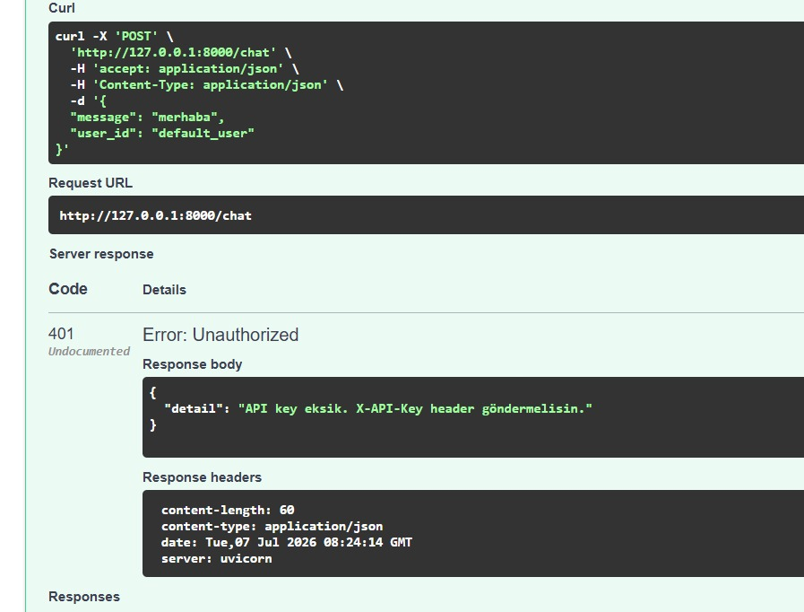
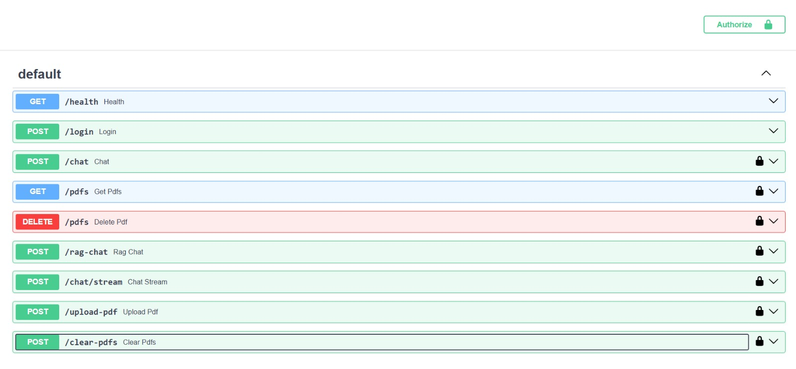
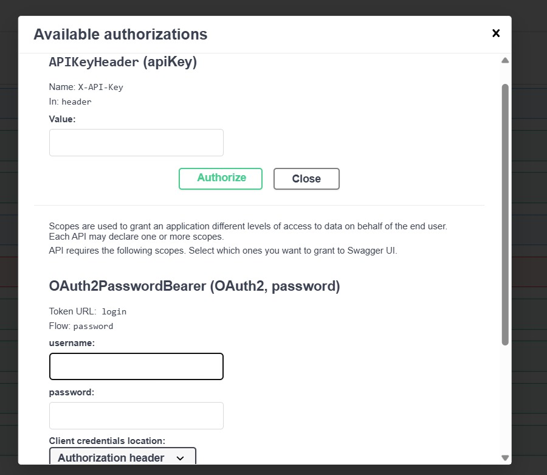
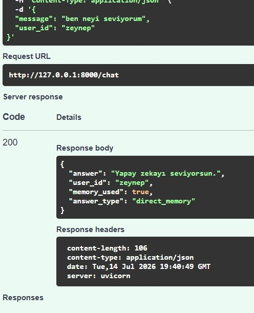

# AgentDemo V3.0 - Local LLM Multi PDF Agentic RAG

AgentDemo V3.0; local LLM, çoklu PDF RAG, OCR, Vision, FastAPI, JWT authentication, kullanıcı bazlı belge izolasyonu, public/private knowledge ayrımı, performans metrikleri ve kullanıcı bazlı long-term memory özelliklerini bir araya getiren uçtan uca bir yapay zeka agent uygulamasıdır.

Proje; Ollama üzerinden local model çalıştırır, Streamlit ile kullanıcı arayüzü sunar, FastAPI ile REST API sağlar, ChromaDB ile PDF belgeleri üzerinde RAG sistemi kurar, SQLite ile kalıcı hafıza tutar ve kullanıcı bazlı erişim kontrolü uygular.

---

## Final Durum

AgentDemo V3.0 artık çalışan bir local AI agent uygulamasıdır.

Uygulama şunları yapabilir:

* Çoklu PDF yükleyebilir
* PDF metinlerini okuyabilir
* Taranmış/görsel PDF sayfalarından OCR ile metin çıkarabilir
* Vision model ile PDF sayfalarını görsel olarak yorumlayabilir
* PDF parçalarını ChromaDB içine kalıcı olarak kaydedebilir
* Aynı PDF dosyasının tekrar işlenmesini engelleyebilir
* PDF belgeleri üzerinde kaynaklı RAG cevapları üretebilir
* Cevaplarda PDF adı, sayfa numarası ve içerik türü gösterebilir
* RAG performans metrikleri döndürebilir
* Streamlit arayüzü üzerinden chat, PDF yükleme, PDF yönetimi ve export işlemleri yapabilir
* FastAPI üzerinden Swagger dokümantasyonu ile API endpointleri sunabilir
* API Key ve JWT Bearer Token authentication destekler
* Token üzerinden `user_id` belirleyebilir
* Kullanıcı bazlı private/public PDF erişimi sağlayabilir
* Kullanıcı bazlı long-term memory tutabilir
* Memory kayıtlarını ekleyebilir, listeleyebilir ve silebilir
* Basit kişisel memory sorularını LLM'e gitmeden doğrudan cevaplayabilir
* Docker ile çalıştırılabilir
* GitHub Actions ile otomatik Docker image build sürecini destekler

---

## Demo Görselleri








---

## Kullanılan Teknolojiler

* Python
* Streamlit
* FastAPI
* Swagger / OpenAPI
* LangChain
* LangGraph
* Ollama
* ChromaDB
* SQLite
* PyPDFLoader
* PyMuPDF / fitz
* Tesseract OCR
* pytesseract
* Pillow
* RecursiveCharacterTextSplitter
* OllamaEmbeddings
* Python Logging
* Docker
* GitHub Actions
* JWT / PyJWT
* API Key Authentication
* nomic-embed-text
* qwen2.5:1.5b
* qwen3-vl:2b

---

## Proje Mimarisi

```text
Kullanıcı
   │
   ├── Streamlit UI
   │       │
   │       ├── Chat
   │       ├── PDF Upload
   │       ├── PDF Yönetimi
   │       ├── Memory Yönetimi
   │       └── Export / Debug
   │
   └── FastAPI REST API
           │
           ├── API Key Authentication
           ├── JWT Bearer Token
           ├── user_id
           └── Swagger Docs

user_id
   │
   ├── Private/Public PDF Erişimi
   ├── Long-Term Memory
   └── RAG Filtreleme

PDF Upload
   │
   ├── Text Extraction
   ├── OCR Extraction
   ├── Vision Description
   ├── Duplicate Check
   └── ChromaDB

RAG Query
   │
   ├── Chroma Similarity Search
   ├── user_id + visibility Filter
   ├── Context Builder
   ├── Ollama LLM
   ├── Sources
   └── Metrics
```

---

## Klasör Yapısı

```text
agent-firstproject/
│
├── app.py
├── api.py
├── agent_core.py
├── agentic_rag.py
├── rag.py
├── vision.py
├── memory_store.py
├── router.py
├── tools.py
├── web_search.py
├── logger_config.py
├── requirements.txt
├── Dockerfile
├── .dockerignore
├── .gitignore
├── README.md
│
├── screenshots/
│   ├── rag-demo.jpg
│   ├── yz1.jpg
│   ├── yz2.jpg
│   ├── yz3.jpg
│   ├── yz4.jpg
│   └── yz5.jpg
│
├── uploads/              # runtime
├── chroma_db/            # runtime
├── memory.sqlite         # runtime
├── memory.sqlite-shm     # runtime
├── memory.sqlite-wal     # runtime
└── agent.log             # runtime
```

Runtime dosyaları GitHub'a gönderilmemelidir.

---

## Dosyaların Görevleri

### `app.py`

Streamlit arayüzünü çalıştırır.

Görevleri:

* Chat ekranını oluşturur
* PDF yükleme alanını gösterir
* Sidebar ayarlarını yönetir
* Thread ID seçimini sağlar
* Kullanıcı ID seçimini sağlar
* PDF visibility seçimini sağlar
* Mesaj geçmişini ekranda tutar
* Router'a kullanıcı mesajını gönderir
* RAG cevaplarını gösterir
* Logları gösterir
* Chat export işlemlerini yönetir
* PDF yönetim panelini sunar
* Memory yönetim panelini sunar

---

### `api.py`

FastAPI REST API katmanını sağlar.

Görevleri:

* Swagger dokümantasyonu sunar
* `/health` endpointini sağlar
* `/login` ile JWT token üretir
* API Key kontrolü yapar
* Bearer token authentication uygular
* `/chat` üzerinden local LLM chat sağlar
* `/rag-chat` üzerinden PDF RAG sorgusu yapar
* `/upload-pdf` üzerinden PDF yükler
* `/pdfs` üzerinden kullanıcıya görünür PDF listesini döndürür
* `/memory` endpointleri ile kullanıcı bazlı memory yönetir
* RAG cevaplarında sources ve metrics döndürür

---

### `agent_core.py`

LLM ve LangGraph agent yapısını oluşturur.

Görevleri:

* Ollama üzerinden local LLM başlatır
* `.env` üzerinden model ayarlarını okur
* Local text model seçimini yönetir
* Fallback model mantığını destekler
* SQLite checkpointer oluşturur
* Thread ID bazlı konuşma hafızasını yönetir

---

### `rag.py`

PDF dosyalarının okunması, ChromaDB’ye aktarılması ve RAG cevaplarının üretilmesinden sorumludur.

Görevleri:

* PDF dosyalarını okur
* PDF metnini çıkarır
* Taranmış/görsel PDF sayfalarında OCR çalıştırır
* Vision modeli ile PDF sayfalarını görsel olarak yorumlar
* PDF dosyaları için hash üretir
* Duplicate PDF yüklemeyi engeller
* Metni chunklara böler
* OllamaEmbeddings ile embedding üretir
* ChromaDB’ye kayıt yapar
* Var olan vectorstore’u tekrar yükler
* Kullanıcı bazlı belge filtrelemesi yapar
* Public/private knowledge ayrımı uygular
* RAG context oluşturur
* Kaynaklı cevap üretir
* RAG performans metriklerini hesaplar

---

### `vision.py`

Görsel ve PDF sayfası yorumlama tarafını yönetir.

Görevleri:

* PDF sayfasından üretilen görseli vision modele gönderir
* Görseldeki karakter, nesne, renk, sahne ve okunabilir yazıları yorumlar
* Vision çıktısını RAG için kullanılabilir metin haline getirir
* Görsel açıklamalarını PDF chunk metadata’sı ile birlikte ChromaDB’ye eklenebilir hale getirir

---

### `memory_store.py`

Kullanıcı bazlı long-term memory sistemini yönetir.

Görevleri:

* SQLite memory tablosu oluşturur
* Kullanıcıya özel memory kaydeder
* Memory kayıtlarını listeler
* Memory kayıtlarını siler
* Kullanıcının memory context’ini oluşturur
* JWT token’dan gelen `user_id` ile memory izolasyonu sağlar

---

### `agentic_rag.py`

Agentic RAG akışını yönetir.

Görevleri:

* Kullanıcı sorusunun belge araması gerektirip gerektirmediğini belirler
* ChromaDB içinde ilgili PDF parçalarını arar
* Gerekirse sorguyu yeniden yazar
* İlgili PDF parçalarını LLM’e context olarak verir
* Kaynaklı cevap üretir
* PDF içinde bilgi yoksa uydurmak yerine “bulunamadı” cevabı verir

---

### `router.py`

Kullanıcı mesajını doğru sisteme yönlendirir.

Yönlendirme örnekleri:

```text
pdf / belge / doküman / yüklediğim → Agentic RAG
hava → Hava durumu demo tool
eksi / çıkar → Basit matematik demo tool
diğer tüm sorular → Agent
```

---

### `logger_config.py`

Projenin log sistemini yönetir.

Log dosyası:

```text
agent.log
```

Loglanan bilgiler:

* Kullanıcı mesajları
* Router kararları
* PDF yükleme işlemleri
* OCR işlemleri
* Vision işlemleri
* RAG aramaları
* Agentic RAG adımları
* Ollama istekleri
* RAG performans metrikleri
* Cevap süreleri
* Hatalar

---

## RAG Mimarisi

PDF yüklendiğinde sistem şu işlemleri yapar:

```text
PDF Yüklenir
      │
      ▼
Hash / Duplicate Kontrolü
      │
      ▼
Text Extraction
      │
      ├── PyPDFLoader
      │
      ├── OCR / Tesseract
      │
      └── Vision Description
      │
      ▼
RecursiveCharacterTextSplitter
      │
      ▼
Chunk'lar Oluşturulur
      │
      ▼
OllamaEmbeddings
      │
      ▼
ChromaDB
      │
      ▼
Kalıcı Vector Database
```

Kullanıcı soru sorduğunda:

```text
Kullanıcı Sorusu
      │
      ▼
user_id / visibility filtresi
      │
      ▼
ChromaDB Similarity Search
      │
      ▼
İlgili PDF Chunk'ları
      │
      ▼
RAG Context
      │
      ▼
Ollama LLM
      │
      ▼
Cevap + Sources + Metrics
```

---

## Agentic RAG Nedir?

Bu projede klasik RAG yerine Agentic RAG mantığı kullanılmaktadır.

Klasik RAG:

```text
Soru gelir
PDF içinde arama yapılır
Bulunan parçalarla cevap verilir
```

Agentic RAG:

```text
Soru gelir
Sistemin PDF'e bakması gerekip gerekmediği anlaşılır
PDF içinde arama yapılır
Gerekirse sorgu yeniden düzenlenir
Tekrar arama yapılır
Cevap sadece belge içeriğine göre üretilir
Kaynaklar gösterilir
Bilgi yoksa uydurulmaz
```

Bu sayede sistem daha kontrollü, daha güvenli ve daha açıklanabilir cevaplar üretir.

---

## Çoklu PDF Desteği

Kullanıcı aynı anda birden fazla PDF yükleyebilir.

Sistem her PDF için:

* Dosya adını kaydeder
* Dosya hash bilgisini tutar
* Dosya boyutunu metadata olarak saklar
* Kullanıcı ID bilgisini metadata olarak saklar
* Visibility bilgisini metadata olarak saklar
* Sayfa bilgisini metadata olarak tutar
* Extraction type bilgisini metadata olarak tutar
* Her sayfayı chunklara böler
* Chunkları ChromaDB’ye ekler
* Cevap verirken hangi PDF, sayfa ve içerik türünden yararlandığını gösterir

Örnek kaynak çıktısı:

```text
Kaynaklar:
- sirineocrdenemesi.pdf / Sayfa 1 / vision
- proje_deneme_pdf.pdf / Sayfa 2 / text
- taranmis_belge.pdf / Sayfa 1 / ocr
```

---

## OCR ve Vision Desteği

AgentDemo V3.0 hem normal PDF metni hem de görsel/taranmış PDF içerikleriyle çalışabilir.

Desteklenen okuma türleri:

```text
text    → PDF içinde seçilebilir metin varsa
ocr     → PDF sayfası görsel/taranmış içerikse
vision  → PDF sayfası görsel olarak yorumlanacaksa
```

OCR tarafında Tesseract kullanılır.

Vision tarafında Ollama üzerinden vision model kullanılır.

Bu sayede sistem:

* Normal PDF metinlerini okuyabilir
* Görsel/taranmış PDF sayfalarından metin çıkarabilir
* PDF sayfasındaki karakter, nesne, renk ve sahne bilgisini yorumlayabilir
* Görsel açıklamasını RAG context içinde kullanabilir

---

## Kullanıcı Bazlı Belge İzolasyonu

AgentDemo V3.0 kullanıcı bazlı belge erişimi destekler.

Her PDF chunk metadata’sında şu alanlar tutulur:

```text
user_id
visibility
source
file_name
file_hash
file_size
page
extraction_type
```

Erişim mantığı:

```text
private PDF → sadece aynı user_id görebilir
public PDF  → tüm kullanıcılar görebilir
başkasının private PDF'i → RAG cevabına dahil edilmez
```

Bu sayede farklı kullanıcıların belgeleri birbirine karışmaz.

---

## Long-Term Memory

AgentDemo V3.0 kullanıcı bazlı long-term memory destekler.

Memory sistemi SQLite üzerinde çalışır.

Memory kayıtları şu alanları içerir:

```text
id
user_id
content
kind
created_at
```

Desteklenen işlemler:

* Memory ekleme
* Memory listeleme
* Memory silme
* Tüm memory kayıtlarını temizleme
* Chat cevaplarında memory context kullanma
* Basit kişisel memory sorularında doğrudan cevap üretme

Örnek:

```text
Memory:
yapay zekayı çok seviyorum

Kullanıcı:
Ben neyi seviyorum?

Cevap:
Yapay zekayı seviyorsun.
```

Memory kayıtları kullanıcı bazlıdır. Bir kullanıcının memory kayıtları başka kullanıcıların cevaplarına karışmaz.

---

## RAG Performans Metrikleri

`/rag-chat` endpointi cevapla birlikte performans metrikleri döndürür.

Örnek metrics çıktısı:

```json
{
  "retrieval_ms": 3239,
  "context_ms": 0,
  "llm_ms": 14056,
  "total_ms": 17295,
  "docs_count": 1,
  "context_chars": 226,
  "source_types": {
    "vision": 1
  }
}
```

Alanların anlamı:

```text
retrieval_ms   → ChromaDB arama süresi
context_ms     → RAG context hazırlama süresi
llm_ms         → LLM cevap üretme süresi
total_ms       → toplam işlem süresi
docs_count     → kullanılan chunk sayısı
context_chars  → LLM'e verilen context uzunluğu
source_types   → text / ocr / vision kaynak dağılımı
```

---

## Persistent Conversation Memory

Projede LangGraph SQLite Checkpointer da kullanılmaktadır.

```python
conn = sqlite3.connect(
    "memory.sqlite",
    check_same_thread=False
)

checkpointer = SqliteSaver(conn)
```

Bu sayede:

* Uygulama kapatılsa bile thread bazlı konuşma hafızası korunabilir
* Aynı Thread ID ile konuşma geçmişi devam edebilir
* Her sohbet ayrı hafızaya sahip olabilir
* Agent önceki konuşmaları kullanabilir

SQLite tarafından oluşturulan dosyalar:

```text
memory.sqlite
memory.sqlite-shm
memory.sqlite-wal
```

Açıklama:

```text
memory.sqlite      → Asıl kalıcı hafıza dosyası
memory.sqlite-shm  → SQLite yardımcı çalışma dosyası
memory.sqlite-wal  → SQLite yazma günlüğü dosyası
```

Bu dosyaların oluşması normaldir.

---

## Thread Sistemi

Her konuşma bir Thread ID ile yönetilebilir.

Örnek Thread ID değerleri:

```text
zeynep_1
test_1
pdf_1
```

Her thread:

* Kendi konuşma hafızasına sahiptir
* Diğer threadlerden bağımsızdır
* SQLite içinde ayrı takip edilir

Bu sayede farklı sohbet oturumları birbirine karışmaz.

---

## Chat Export

Chat export sistemi desteklenir.

Desteklenen formatlar:

* TXT
* JSON

TXT export insan tarafından okunabilir konuşma çıktısı sağlar.

JSON export ise ileride tekrar işlenebilir, analiz edilebilir veya başka sisteme aktarılabilir bir yapı sunar.

Export edilen veri:

* Thread ID
* Export tarihi
* Kullanıcı mesajları
* Asistan cevapları

---

## REST API

API çalıştırma:

```bash
python -m uvicorn api:app --host 127.0.0.1 --port 8000 --reload
```

Swagger dokümantasyonu:

```text
http://127.0.0.1:8000/docs
```

### Temel Endpointler

```text
GET    /health
POST   /login
POST   /chat
GET    /pdfs
POST   /rag-chat
POST   /upload-pdf
DELETE /pdfs
POST   /clear-pdfs
POST   /chat/stream
POST   /memory
GET    /memory
DELETE /memory/{memory_id}
DELETE /memory
```

### Authentication

API iki güvenlik yaklaşımını destekler:

```text
X-API-Key header
Authorization: Bearer <JWT_TOKEN>
```

API Key örneği:

```http
X-API-Key: your-api-key
```

JWT örneği:

```http
Authorization: Bearer eyJhbGciOi...
```

JWT token `/login` endpointinden alınır.

---

## `.env` Örneği

Gerçek `.env` dosyası GitHub’a gönderilmemelidir.

Örnek yapı:

```env
TAVILY_API_KEY=your_tavily_key

AGENTDEMO_API_KEY=your_api_key

JWT_SECRET_KEY=your_long_jwt_secret
JWT_EXPIRE_MINUTES=120

DEMO_USERNAME=zeynep
DEMO_PASSWORD=123456

TEXT_MODEL=qwen2.5:1.5b
TEXT_MODEL_FALLBACKS=llama3.2:1b,gemma2:2b,mistral:latest
EMBEDDING_MODEL=nomic-embed-text
VISION_MODEL=qwen3-vl:2b

OLLAMA_BASE_URL=http://localhost:11434
OLLAMA_NUM_CTX=768
OLLAMA_NUM_PREDICT=100
OLLAMA_KEEP_ALIVE=0

RAG_CHUNK_SIZE=700
RAG_CHUNK_OVERLAP=80
RAG_SEARCH_K=6
RAG_FINAL_K=2
RAG_MAX_CONTEXT_CHARS=1500

ALWAYS_RUN_OCR=true
USE_VISION_FALLBACK=false

MEMORY_DB_PATH=memory.sqlite
```

---

## Kurulum

Gerekli paketleri yükleyin:

```bash
pip install -r requirements.txt
```

Tesseract OCR kurulmalıdır.

Windows için örnek:

```powershell
winget install -e --id UB-Mannheim.TesseractOCR
```

Ollama modellerini indirin:

```bash
ollama pull qwen2.5:1.5b
ollama pull nomic-embed-text
ollama pull qwen3-vl:2b
```

Fallback model kullanmak isterseniz:

```bash
ollama pull llama3.2:1b
ollama pull gemma2:2b
```

Ollama’nın çalıştığından emin olun:

```bash
ollama list
```

---

## Çalıştırma

Streamlit arayüzü:

```bash
streamlit run app.py
```

FastAPI REST API:

```bash
python -m uvicorn api:app --host 127.0.0.1 --port 8000 --reload
```

Docker:

```bash
docker build -t agentdemo-v3 .
docker run -p 8501:8501 --env-file .env agentdemo-v3
```

Docker ile host Ollama kullanılıyorsa:

```bash
docker run -p 8501:8501 --env-file .env -e OLLAMA_BASE_URL=http://host.docker.internal:11434 agentdemo-v3
```

---

## Örnek Kullanım

### PDF RAG Testi

PDF yükle:

```text
sample_ai_document.pdf
```

Soru sor:

```text
Bu belgede ne anlatılıyor?
```

veya:

```text
Bu PDF içindeki başlıkları listele.
```

Sistem ilgili sayfaları bulur ve kaynak göstererek cevap verir.

---

### Vision RAG Testi

Vision açık şekilde PDF yükle.

Soru sor:

```text
Bu PDF'in 1. sayfasındaki görseli 2 cümlede açıkla.
```

Örnek cevap:

```text
PDF’in 1. sayfasında ana olarak bir Smurf karakteri görünüyor. Okunabilir yazı tespit edilmemiş.
```

Örnek kaynak:

```text
sirineocrdenemesi.pdf / Sayfa 1 / vision
```

---

### Long-Term Memory Testi

Memory ekle:

```json
{
  "content": "yapay zekayı çok seviyorum",
  "kind": "preference"
}
```

Soru sor:

```text
Ben neyi seviyorum?
```

Beklenen cevap:

```text
Yapay zekayı seviyorsun.
```

---

### Agentic RAG Testi

PDF içinde olmayan bir bilgi sor:

```text
Bu PDF'de uzay yolculuğu anlatılıyor mu?
```

Eğer bilgi belgede yoksa sistemin beklenen cevabı:

```text
Bu bilgi PDF'lerde bulunamadı.
```

Bu davranış sistemin uydurma yapmadığını gösterir.

---

## Logging Sistemi

Projede Python Logging kullanılmaktadır.

Log dosyası:

```text
agent.log
```

Örnek log çıktısı:

```text
Kullanıcı mesajı: sana yüklediğim pdf ne hakkında
Thread ID: zeynep_1
Router: Agentic RAG seçildi.
Agentic RAG: İlk arama başlatıldı.
HTTP Request: POST http://127.0.0.1:11434/api/embed "HTTP/1.1 200 OK"
Agentic RAG: Final cevap üretiliyor.
HTTP Request: POST http://127.0.0.1:11434/api/chat "HTTP/1.1 200 OK"
RAG metrics | user_id=zeynep | docs=1 | context_chars=226 | retrieval_ms=3239 | llm_ms=14056 | total_ms=17295
Cevap süresi: 17.29 saniye
```

Loglar sayesinde sistemin hangi adımda çalıştığı veya hata verdiği takip edilebilir.

---

## Git Ignore

Aşağıdaki dosya ve klasörler GitHub’a gönderilmemelidir:

```gitignore
.env
agent.log
memory.sqlite
memory.sqlite-shm
memory.sqlite-wal
chroma_db/
uploads/
__pycache__/
*.pyc
```

---

## Version Geçmişi

### Version 1.0

* [x] Streamlit UI
* [x] LangChain Agent
* [x] LangGraph Memory
* [x] SQLite Checkpointer
* [x] Tek PDF RAG
* [x] ChromaDB
* [x] Logging
* [x] Thread System

---

### Version 2.0

* [x] Modüler mimari
* [x] Çoklu PDF desteği
* [x] Agentic RAG
* [x] Chat Export
* [x] ChromaDB kalıcı vectorstore
* [x] Ollama embedding entegrasyonu
* [x] Router geliştirmesi
* [x] Kaynak sayfa gösterimi
* [x] Log paneli
* [x] Cevap süresi takibi
* [x] SQLite kalıcı hafıza
* [x] Thread bazlı sohbet sistemi

---

### Version 3.0 Final

* [x] Gerçek Web Search entegrasyonu
* [x] OCR desteği
* [x] Taranmış/görsel PDF içindeki yazıları okuma
* [x] Vision ile görsel PDF yorumlama
* [x] PDF duplicate engelleme
* [x] PDF listeleme paneli
* [x] PDF silme sistemi
* [x] Kullanıcı bazlı long-term memory
* [x] SQLite tabanlı memory store
* [x] JWT token üzerinden memory izolasyonu
* [x] `/memory` kayıt listeleme silme endpointleri
* [x] `/chat` cevaplarında kullanıcı hafızası kullanımı
* [x] Basit memory sorularında direct memory answer sistemi
* [x] Gerçek streaming response
* [x] REST API
* [x] FastAPI kurulumu
* [x] Swagger dokümantasyonu
* [x] API sağlık kontrolü
* [x] API üzerinden local LLM chat
* [x] API üzerinden PDF listeleme
* [x] API üzerinden PDF RAG sorgulama
* [x] API üzerinden OCR destekli PDF işleme
* [x] API üzerinden PDF yükleme
* [x] API üzerinden Vision destekli PDF görsel yorumlama
* [x] API üzerinden PDF duplicate engelleme
* [x] API üzerinden seçili PDF silme
* [x] API üzerinden tüm PDF veritabanını temizleme
* [x] Docker desteği
* [x] GitHub Actions
* [x] Authentication sistemi
* [x] API Key Authentication
* [x] `X-API-Key` header kontrolü
* [x] `.env` üzerinden gizli API key yönetimi
* [x] `/chat`, `/rag-chat`, `/upload-pdf`, `/pdfs`, `/clear-pdfs`, `/chat/stream` endpointlerini koruma
* [x] API requestlerinde `user_id` temeli
* [x] PDF upload için `visibility` alanı temeli
* [x] JWT tabanlı kullanıcı girişi
* [x] Kullanıcı bazlı belge alanları
* [x] Kullanıcı bazlı ChromaDB filtreleme
* [x] Public / private knowledge ayrımı
* [x] `/login` endpointi
* [x] Bearer token authentication
* [x] Token üzerinden `user_id` belirleme
* [x] PDF upload sırasında kullanıcıyı token’dan alma
* [x] RAG sorgularında token kullanıcısına göre belge filtreleme
* [x] Daha hızlı model ve embedding optimizasyonu
* [x] RAG context karakter limiti
* [x] RAG source type metrics
* [x] Duplicate RAG chunk temizleme
* [x] Direct memory answer sistemi

---

## Mevcut Sınırlamalar

* Local model kullanıldığı için cevap süresi donanıma göre değişebilir.
* Küçük local modeller bazı cevaplarda promptu tam takip etmeyebilir.
* Vision model kalitesi kullanılan modele ve PDF sayfasının netliğine bağlıdır.
* OCR başarısı görsel kalitesi, font, sayfa çözünürlüğü ve Tesseract dil paketlerine bağlıdır.
* Aynı anda text model, embedding model ve vision model çalıştığında RAM/VRAM kullanımı artabilir.
* Demo kullanıcı sistemi `.env` üzerinden tanımlanan kullanıcı adı/şifre ile çalışır.
* Production ortamı için gerçek kullanıcı kayıt sistemi, şifre hashleme, rate limit ve admin panel eklenebilir.
* Local Ollama kullanıldığı için model dosyaları Docker image içine gömülü değildir; Ollama host üzerinde çalışmalıdır.

---

## Neden ChromaDB Kullanıldı?

Bu projede ChromaDB tercih edilmiştir çünkü:

* Metadata yönetimi kolaydır
* PDF kaynak ve sayfa bilgisiyle çalışmak rahattır
* Kalıcı kayıt yapısı uygundur
* Kullanıcı bazlı filtreleme için düzenlidir
* Public/private knowledge ayrımı için metadata filtreleri kullanılabilir
* Çoklu PDF ve kaynak gösterimi için pratik bir yapı sunar

FAISS ileride alternatif vector backend olarak eklenebilir, ancak AgentDemo V3.0 için ana vector database ChromaDB olarak bırakılmıştır.

---

## Amaç

Bu projenin amacı:

* LangChain öğrenmek
* LangGraph checkpointer mantığını anlamak
* Local LLM kullanmak
* Ollama ile model çalıştırmak
* RAG mimarisini uygulamak
* Agentic RAG akışını deneyimlemek
* Streamlit ile AI arayüzü geliştirmek
* FastAPI ile AI REST API geliştirmek
* SQLite ile kalıcı hafıza kullanmak
* ChromaDB ile vector database mantığını öğrenmek
* OCR ve Vision destekli PDF işleme denemek
* JWT ve API Key authentication mantığını uygulamak
* Kullanıcı bazlı belge ve memory izolasyonu kurmak
* Modüler Python proje yapısı oluşturmak

---

## Bu Projede Öğrenilenler

Bu proje geliştirilirken aşağıdaki konular üzerinde çalışıldı:

* Agent mimarisi
* LangChain kullanımı
* LangGraph kullanımı
* Checkpointer mantığı
* SQLite Memory
* Kullanıcı bazlı long-term memory
* Thread ID yönetimi
* RAG mimarisi
* Agentic RAG yaklaşımı
* Embedding sistemleri
* ChromaDB
* PDF chunking
* OCR
* Vision model kullanımı
* Metadata yönetimi
* Kullanıcı bazlı filtreleme
* Public/private knowledge ayrımı
* FastAPI
* Swagger
* JWT authentication
* API Key authentication
* Router tasarımı
* Logging
* Metrics toplama
* Streamlit chat arayüzü
* Chat export
* Docker
* GitHub Actions
* Modüler Python proje yapısı
* Local LLM çalışma mantığı
* Ollama model yönetimi

---

## Kısa Açıklama

AgentDemo V3.0; Ollama, LangChain, LangGraph, FastAPI, Streamlit, ChromaDB ve SQLite kullanılarak geliştirilmiş local çalışan bir Agentic RAG uygulamasıdır.

Kullanıcı çoklu PDF yükleyebilir, OCR ve Vision destekli belge analizi yapabilir, kaynaklı RAG cevapları alabilir, JWT ile giriş yapabilir, kullanıcı bazlı private/public belge erişimi kullanabilir ve long-term memory ile kişisel bilgilerini kalıcı şekilde saklayabilir.

Bu proje, local AI agent mimarisi, PDF tabanlı RAG, kullanıcı bazlı veri izolasyonu ve API tabanlı yapay zeka uygulaması geliştirme pratiği için tamamlanmış bir portfolyo projesidir.
