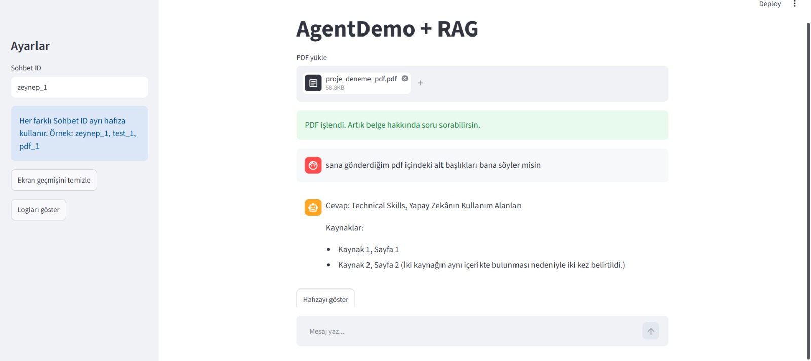

# AgentDemo - Ollama + LangChain + LangGraph + Streamlit + RAG

Bu proje, local LLM kullanarak çalışan basit ama geliştirilebilir bir yapay zeka agent uygulamasıdır. Projede Ollama üzerinden local model çalıştırılır, Streamlit ile arayüz sağlanır, LangGraph ile kalıcı hafıza eklenir ve PDF dosyaları üzerinden RAG sistemi kullanılır.

---

## Durum

Bu proje;

* LangChain
* LangGraph
* SQLite Memory
* Ollama
* Streamlit
* RAG
* ChromaDB

teknolojilerini öğrenmek amacıyla geliştirilmiş ilk çalışan sürümdür.

---

## Demo

### PDF RAG Sistemi



Bu demo ekranında:

* PDF yükleme
* RAG ile belge sorgulama
* Kaynak sayfa gösterimi
* Kalıcı hafıza sistemi
* Thread bazlı sohbet yönetimi

özellikleri gösterilmektedir.

---

# Özellikler

* Local LLM desteği
* Ollama entegrasyonu
* Streamlit chat arayüzü
* LangChain agent yapısı
* LangGraph entegrasyonu
* SQLite tabanlı kalıcı hafıza
* Thread bazlı sohbet sistemi
* Router tabanlı yönlendirme
* PDF tabanlı RAG sistemi
* ChromaDB vector database
* Ollama embedding desteği
* Kaynak gösterimli cevaplar
* Python logging sistemi
* Sidebar log görüntüleme paneli
* Hata yönetimi (try/except)
* Cevap süresi takibi
* Basit tool sistemi

### Mevcut Toollar

* Hava durumu sorgulama
* Çıkarma işlemi
* Demo web search

---

# Kullanılan Teknolojiler

* Python
* Streamlit
* LangChain
* LangGraph
* Ollama
* ChromaDB
* SQLite
* PyPDFLoader
* RecursiveCharacterTextSplitter
* OllamaEmbeddings
* Logging
* Mistral
* nomic-embed-text

---

# Proje Mimarisi

```text
Kullanıcı Mesajı
        │
        ▼
Streamlit Arayüzü
        │
        ▼
Router
        │
 ┌──────┼──────────┐
 │      │          │
 ▼      ▼          ▼
RAG   Toollar   Agent
 │                 │
 ▼                 ▼
ChromaDB      LangGraph
 │                 │
 ▼                 ▼
Ollama       SQLite Memory
        │
        ▼
      Cevap
```

---

# RAG Mimarisi

PDF dosyası yüklendiğinde sistem şu işlemleri gerçekleştirir:

```text
PDF yüklenir
      │
      ▼
PyPDFLoader
      │
      ▼
Metin Chunk'lara Ayrılır
      │
      ▼
OllamaEmbeddings
      │
      ▼
ChromaDB
      │
      ▼
Similarity Search
      │
      ▼
LLM'e Context Verilir
      │
      ▼
Kaynak Gösterimli Cevap Üretilir
```

---

# Persistent Memory

Projede LangGraph SQLite Checkpointer kullanılmaktadır.

```python
conn = sqlite3.connect(
    "memory.sqlite",
    check_same_thread=False
)

checkpointer = SqliteSaver(conn)
```

Bu sayede:

* Uygulama kapatılsa bile hafıza kaybolmaz.
* Aynı thread tekrar açıldığında konuşma geçmişi korunur.
* Her thread bağımsız hafızaya sahiptir.

---

# Thread Sistemi

Her sohbet farklı bir Thread ID kullanabilir.

Örnek:

```text
zeynep_1
test_1
pdf_1
```

Her thread:

* Kendi hafızasına sahiptir.
* Kendi konuşma geçmişini saklar.
* Diğer threadlerden bağımsız çalışır.

---

# Logging Sistemi

Projede Python Logging kullanılmaktadır.

Log dosyası:

```text
agent.log
```

Loglanan olaylar:

* PDF yükleme
* Vectorstore oluşturma
* Chunk üretimi
* RAG sorguları
* Agent cevapları
* Hatalar
* Cevap süreleri
* Router kararları

Örnek log:

```text
2026-06-11 22:01:13 | INFO | PDF yüklendi
2026-06-11 22:01:15 | INFO | Chunk sayısı: 12
2026-06-11 22:01:21 | INFO | RAG için 3 kaynak bulundu
2026-06-11 22:01:28 | INFO | Cevap süresi: 4.12 saniye
```

---

# Kurulum

Gerekli paketleri yükleyin:

```bash
pip install streamlit
pip install langchain
pip install langgraph
pip install langgraph-checkpoint-sqlite
pip install langchain-ollama
pip install langchain-community
pip install langchain-text-splitters
pip install langchain-chroma
pip install chromadb
pip install pypdf
```

---

# Ollama Modelleri

```bash
ollama pull mistral
ollama pull nomic-embed-text
```

---

# Çalıştırma

```bash
streamlit run main.py
```

---

# Örnek Kullanım

## Hafıza Testi

Kullanıcı:

```text
Benim adım Zeynep.
```

Sonra:

```text
Benim adım ne?
```

Sistem konuşma geçmişini kullanarak cevap verebilir.

---

## PDF RAG Testi

PDF yükle:

```text
sample_ai_document.pdf
```

Soru sor:

```text
Bu belgede ne anlatılıyor?
```

veya:

```text
Bu PDF içindeki başlıkları listele.
```

Sistem ilgili sayfaları bulur ve kaynak göstererek cevap verir.

---

# Router Mantığı

Local modellerin tool calling davranışları her zaman stabil olmadığı için basit bir Router kullanılmaktadır.

Router aşağıdaki yönlendirmeleri yapar:

```text
hava → Hava durumu

eksi / çıkar → Matematik

pdf / belge / doküman → RAG

diğer tüm sorular → Agent
```

Bu yaklaşım:

* Daha hızlıdır
* Daha stabildir
* Daha öngörülebilirdir

---

# Mevcut Sınırlamalar

* Local model kullanıldığı için cevap süresi uzun olabilir.
* Mistral bazı Türkçe cevaplarda hatalar yapabilir.
* Web search gerçek internet araması değildir.
* Tool calling tamamen modele bırakılmamıştır.
* OCR desteği bulunmamaktadır.
* Görsel PDF'lerde başarı düşebilir.
* Tek PDF odaklı çalışmaktadır.

---

# Gelecek Geliştirmeler

* Long-Term Memory
* Multi PDF RAG
* Agentic RAG
* Gerçek Web Search
* OCR Desteği
* Streaming Cevaplar
* FAISS Desteği
* Chat Export (TXT / JSON)
* Docker Desteği
* Kullanıcı Yönetimi
* Authentication Sistemi
* API Endpointleri

---

# Proje Yapısı

```text
agent-demo/
│
├── main.py
├── README.md
├── requirements.txt
├── memory.sqlite
├── agent.log
│
├── uploads/
│
├── chroma_db/
│
└── screenshots/
    └── rag-demo.png
```

---

# requirements.txt

```txt
streamlit
langchain
langgraph
langgraph-checkpoint-sqlite
langchain-ollama
langchain-community
langchain-text-splitters
langchain-chroma
chromadb
pypdf
```

---

# Amaç

Bu proje;

* LangChain
* LangGraph
* Ollama
* SQLite Memory
* ChromaDB
* RAG

konularını öğrenmek ve gerçek bir yapay zeka uygulaması geliştirme sürecini deneyimlemek amacıyla geliştirilmiştir.


